# 🩻 CheXpert Multi-Label Chest X-Ray Classification

A group project by **Mehraveh, Parsa, and Arian** exploring different deep-learning approaches for multi-label chest X-ray classification on the **CheXpert** dataset.

The project contains three distinct modeling approaches:

- **Mehraveh:** ImageNet-pretrained **DenseNet-121**
- **Arian:** compact **CNN + selective state-space (Mamba-style) hybrid**
- **Parsa:** **GNN + CNN + Attention** and **Bayesian CNN** approaches

## 🧭 Project Overview

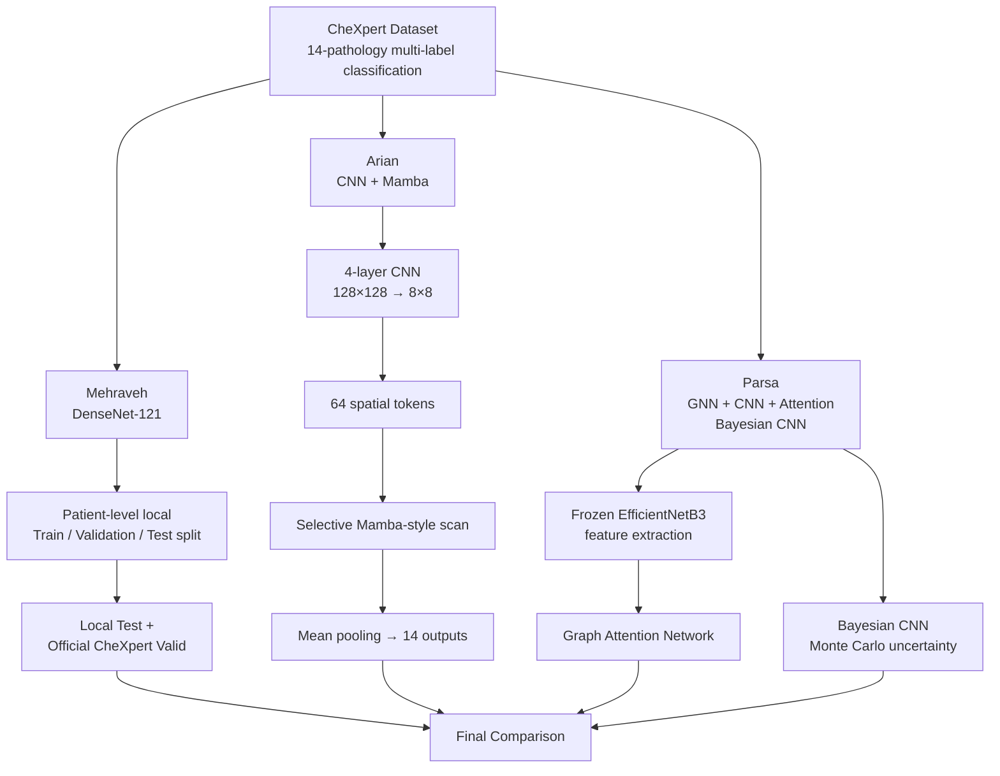

> **Important evaluation note:** The three approaches do not use identical evaluation protocols. Mehraveh created a patient-level local train/validation/test split from the training data, using **0.1 for validation and 0.1 for test**. Parsa and Arian did **not** create local train/validation/test splits; their validation set was approximately **200 studies**, while training used approximately **200,000 studies**. Therefore, Mehraveh's local test evaluation provides a more reliable estimate of held-out performance within the training dataset, while the Arian and Parsa validation results should be interpreted as development/validation results rather than directly equivalent test-set measurements.

---

# 👩‍💻 Mehraveh's Part

## CheXpert Multi-Label Chest X-Ray Classification

A PyTorch pipeline that trains an **ImageNet-pretrained DenseNet-121** to detect 14 pathologies from frontal chest X-rays using the CheXpert dataset, then evaluates it on both a local held-out test set and the official CheXpert `valid.csv` split.

## What's in the Notebook

The notebook is an end-to-end training and evaluation pipeline:

| Stage | What it does |
|---|---|
| Setup | Installs dependencies, detects GPU/CUDA, fixes random seeds |
| Data loading | Loads `train.csv` / `valid.csv`, resolves and verifies image paths |
| Patient-level split | Splits by `patient_id` into train / validation / test |
| Uncertainty handling | Configurable U-Ignore / U-Zeros / U-Ones / per-pathology strategy |
| Data pipeline | Resize, grayscale → 3-channel, ImageNet normalization, mild augmentation |
| Model | ImageNet-pretrained DenseNet-121, 14-way multi-label head |
| Training | AdamW + `ReduceLROnPlateau`, early stopping, best/latest checkpointing |
| Evaluation | AUROC, PR-AUC, F1, Recall, Precision, Specificity, Brier score |
| Explainability | Grad-CAM heatmaps for representative predictions |

## Data Split and Evaluation

Mehraveh's approach differs importantly from the other project members' evaluation setup.

- A **patient-level local split** was created from the CheXpert training dataset.
- **10% of the training data was used for local validation.**
- **10% of the training data was used for local test evaluation.**
- Splitting at the patient level avoids patient-level leakage between the local subsets.
- Classification thresholds were selected using the local validation set and then frozen for subsequent evaluation.
- The model was evaluated on both the **local held-out test set** and the **official CheXpert validation set**.

This makes the local test set a stronger held-out evaluation than a validation-only result, although it remains a locally constructed split rather than the official CheXpert test benchmark.

## Training Time

**Training time: 1 hour 50 minutes**

## Results

### Training Curves

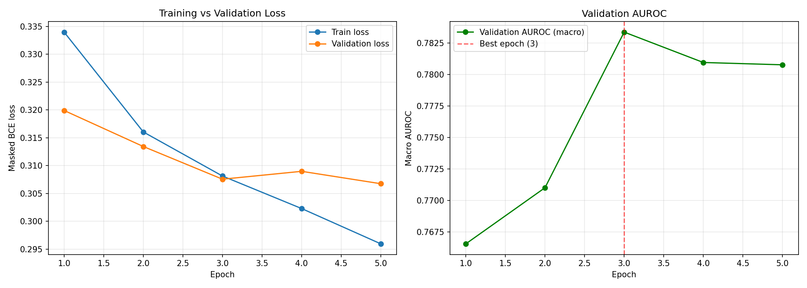

### ROC Curves — Local Test Set

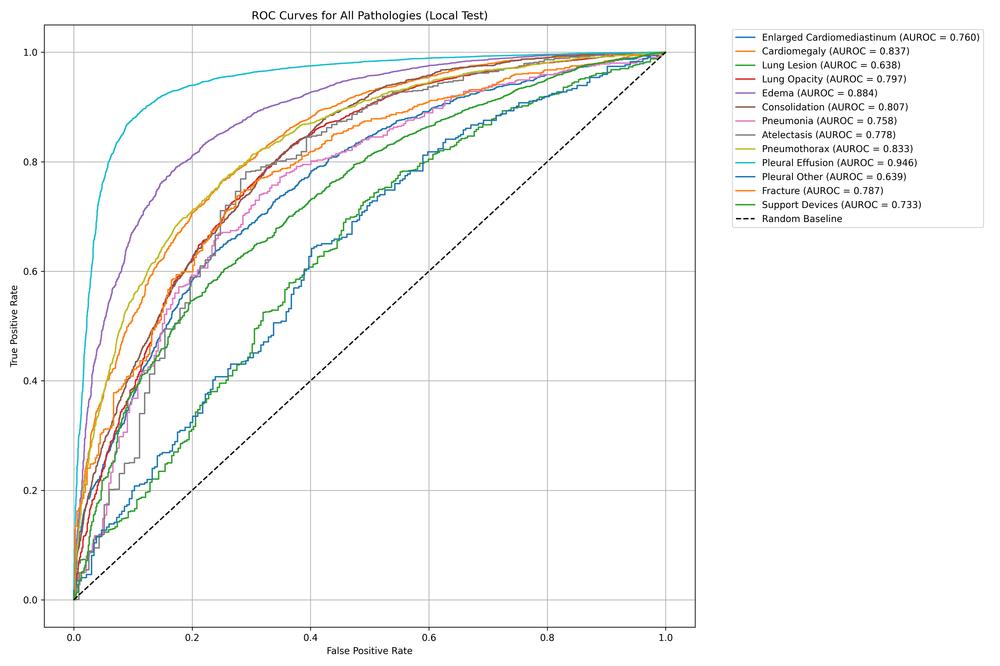

### Precision–Recall Curves — Local Test Set

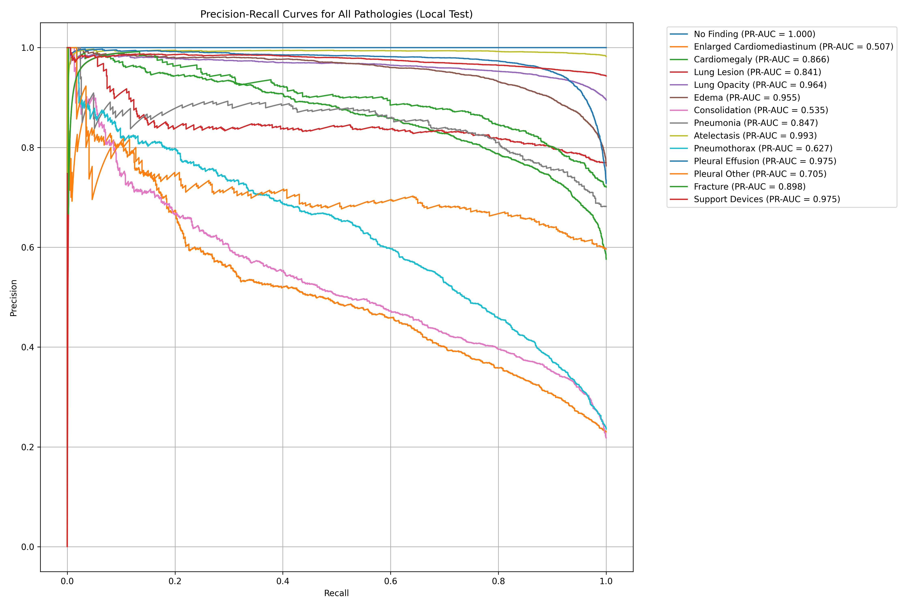

### AUROC by Pathology

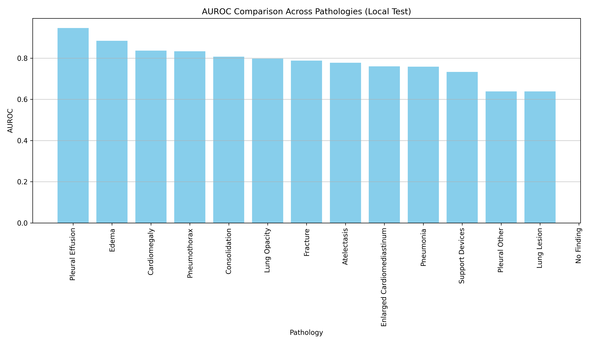

### Grad-CAM Examples

Model attention overlaid on representative chest X-rays provides a qualitative sanity check of where the model is focusing.

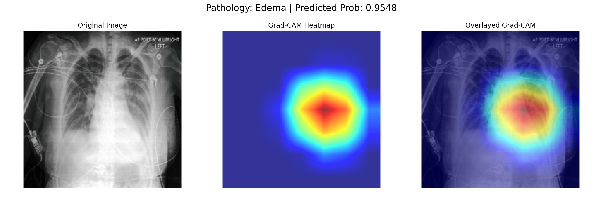

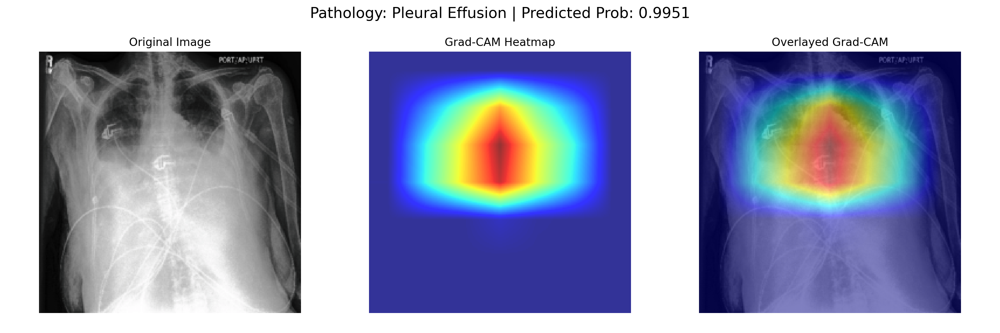

## Final Evaluation Results

Macro-averaged metrics on Mehraveh's local test set and the official CheXpert validation set:

| Metric | Local Test | Official CheXpert Valid |
|---|---:|---:|
| AUROC | **0.7843** | **0.8271** |
| PR-AUC | **0.8222** | **0.5252** |
| Brier Score | **0.1930** | **0.2089** |
| F1 | **0.7624** | **0.3705** |
| Recall | **0.8450** | **0.7729** |
| Precision | **0.7573** | **0.2853** |
| Specificity | **0.3707** | **0.3874** |

**Best validation AUROC during training:** 0.78 (epoch 3)

**Best-performing pathology:** Pleural Effusion (AUROC 0.95)

**Hardest pathology:** Lung Lesion (AUROC 0.64)

## Evaluation Methodology

- Per-pathology classification thresholds were selected **only from the local validation set**, maximizing F1.
- The selected thresholds were then frozen and reused on the local test set and official CheXpert validation set.
- Metrics were macro-averaged across the 14 pathologies, skipping pathologies with only one class present in a split.
- The official CheXpert validation set is small, so its metrics have substantial sampling noise.

## Limitations

- CheXpert labels are automatically extracted from radiology reports and contain label noise and uncertainty.
- The uncertainty-handling strategy is a modeling choice rather than a proven-optimal strategy.
- Grad-CAM indicates correlation with model output, not clinical or diagnostic validity.

---

# 🤖 Arian's Part

## CheXpert Multi-Label Chest X-Ray Classification with a CNN–Mamba Hybrid

A compact convolutional network paired with a **selective state-space (Mamba-style) scan**, trained to detect 14 clinical findings from frontal chest radiographs.

| Aspect | Detail |
|---|---|
| Dataset | CheXpert-small, frontal-view studies |
| Task | Multi-label classification of 14 independent findings |
| Approach | CNN feature extractor → selective state-space scan → linear classifier |
| Parameters | **263,070 trainable parameters** |
| Best result | **Mean AUROC 0.772** across 14 classes after 8 epochs |
| Runtime | Google Colab, GPU recommended |

## Overview

A four-layer convolutional backbone reduces each 128×128 chest X-ray to an 8×8 grid of feature vectors. The grid is flattened into a sequence of 64 tokens and passed through a selective scan. The scanned sequence is mean-pooled and passed to a linear classifier with one output per pathology.

The model deliberately uses a compact, from-scratch architecture rather than a large pretrained backbone.

## Model Architecture

| Stage | Detail |
|---|---|
| CNN backbone | 4× `Conv2d(stride=2) → BatchNorm → ReLU`, channels 3→32→64→128→128 |
| Tokenization | 8×8 grid flattened to 64 tokens of width `D_MODEL = 128` |
| Selective scan | Sequential recurrence over 64 tokens, state size `D_STATE = 8` per channel |
| Pooling | Mean over all 64 scanned tokens |
| Classifier | Linear layer, `D_MODEL → 14` |
| Total | **263,070 trainable parameters** |

## Selective Scan

At each step, a hidden state is updated from the previous state and current input token:

```text
x_t = A_bar * x_{t-1} + B_bar * u_t
y_t = C * x_t
```

The Mamba-style component makes the step size and input/output projections token-dependent:

```text
delta_t = softplus(Linear(u_t))
B_t     = Linear(u_t)
C_t     = Linear(u_t)
A_bar_t = exp(delta_t * A)
```

This allows the model to adapt its state update to each spatial token.

## Data and Evaluation

- CheXpert-small, frontal-view studies.
- Approximately **191,027 training studies** and **202 validation studies**.
- Images resized to 128×128 and normalized with ImageNet mean/std.
- Random horizontal flipping was applied during training.
- Uncertain labels were mapped according to the documented policy: positive for Atelectasis, Edema, Pleural Effusion, Cardiomegaly, and Consolidation, and negative for the remaining findings; unmentioned findings were treated as negative.
- **No separate local train/validation/test split was created.**
- The reported validation performance is therefore based on the approximately 200-study validation set rather than a locally held-out test set.

## Training Configuration

| Hyperparameter | Value |
|---|---|
| Epochs | 8 |
| Batch size | 32 |
| Optimizer | AdamW, lr = 1e-4 |
| Loss | `BCEWithLogitsLoss` |
| Gradient clipping | Max norm 1.0 |
| Seed | 42 |
| Training time | **2.5 hours** |

## Results

### Learning Curves

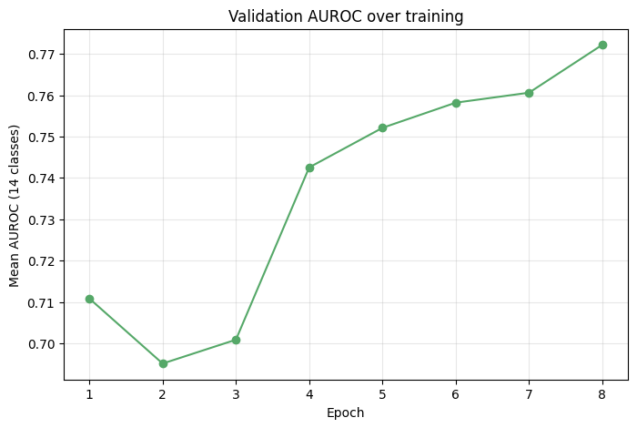

| Epoch | Train loss | Val loss | Val mean AUROC |
|---:|---:|---:|---:|
| 1 | 0.3711 | 0.4521 | 0.7108 |
| 2 | 0.3576 | 0.4382 | 0.6951 |
| 3 | 0.3521 | 0.4449 | 0.7009 |
| 4 | 0.3484 | 0.4221 | 0.7425 |
| 5 | 0.3456 | 0.4302 | 0.7521 |
| 6 | 0.3432 | 0.4247 | 0.7582 |
| 7 | 0.3410 | 0.4104 | 0.7606 |
| **8** | **0.3393** | 0.4276 | **0.7722** |

### Per-Class AUROC

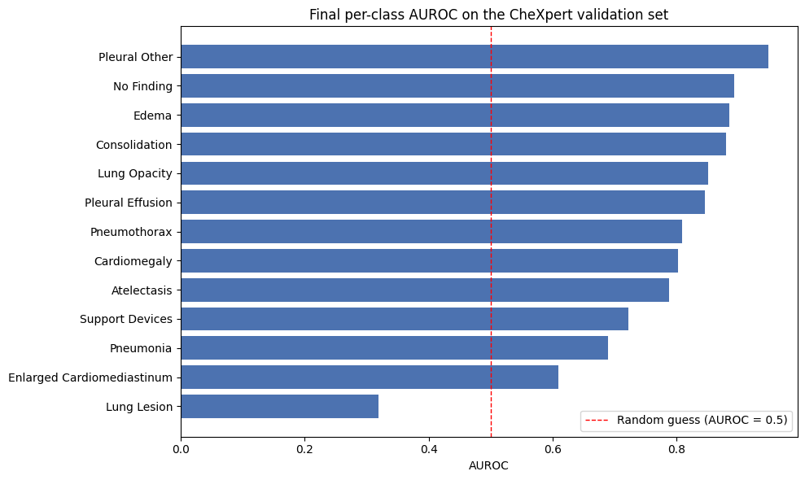

| Pathology | AUROC | Positive cases (val) |
|---|---:|---:|
| Pleural Other | 0.948 | 1 |
| No Finding | 0.892 | 26 |
| Edema | 0.884 | 39 |
| Consolidation | 0.880 | 32 |
| Lung Opacity | 0.851 | 111 |
| Pleural Effusion | 0.846 | 63 |
| Pneumothorax | 0.808 | 7 |
| Cardiomegaly | 0.802 | 64 |
| Atelectasis | 0.788 | 72 |
| Support Devices | 0.722 | 95 |
| Pneumonia | 0.689 | 8 |
| Enlarged Cardiomediastinum | 0.609 | 99 |
| Lung Lesion | 0.319 | 1 |
| Fracture | N/A | 0 |

The strongest-looking results for rare classes should be interpreted cautiously because some classes have only one or a few positive validation examples. In particular, Lung Lesion has one positive case and Fracture has no positive validation cases.

### ROC Curves

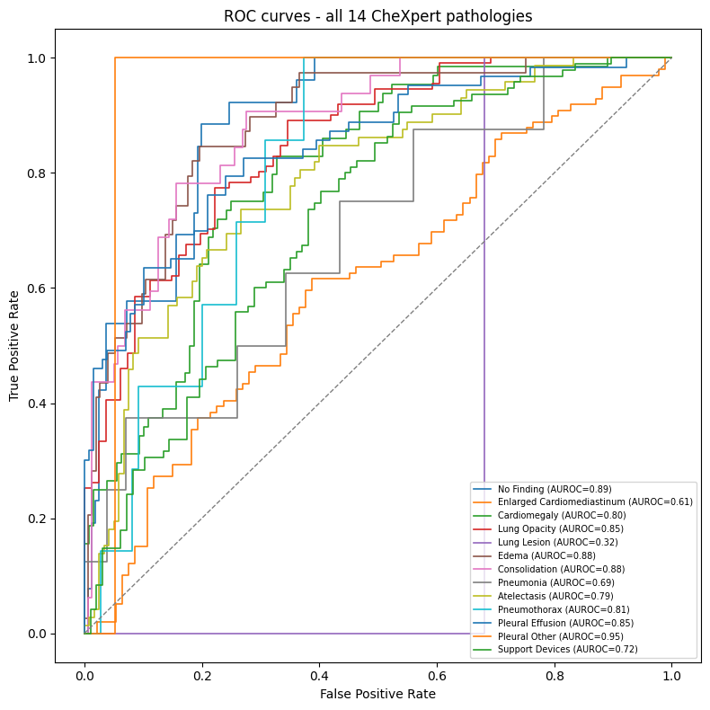

### Confusion Matrix — Cardiomegaly

| | Predicted Negative | Predicted Positive |
|---|---:|---:|
| **Actual Negative** | 128 | 0 |
| **Actual Positive** | 62 | 2 |

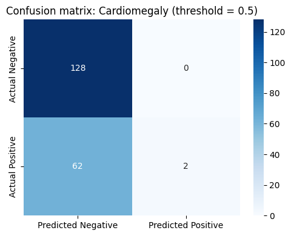

## Limitations

- The validation set contains only approximately 200 studies, making rare-class metrics highly unstable.
- No separate local test set was created.
- The 128×128 image resolution and single selective-scan layer were chosen for computational efficiency rather than maximum accuracy.
- The model is a development/validation experiment and should be evaluated on an official test set for benchmark-level conclusions.

## Assets

Arian's assets are stored under:

```text
assets/
├── learning_curves.png
├── auroc.png
├── roc_curves.png
└── confusion_matrix.png
```

---

# 🧠 Parsa's Part

## Architectures

### Hybrid GAT-CNN

The Hybrid GAT-CNN model extracts global features using a **frozen EfficientNetB3** backbone. These features are passed into a custom **Graph Attention Network (GAT)** layer designed to model co-occurrence and dependencies between different diseases.

### Bayesian CNN

The Bayesian CNN uses **TensorFlow Probability**, replacing standard layers with `Convolution2DReparameterization` and `DenseReparameterization`. The approach is designed to capture epistemic uncertainty by producing probability distributions through Monte Carlo sampling.

### Optimization

Both pipelines use custom **class-weighted binary cross-entropy** losses to penalize minority-class misclassifications. The GAT implementation uses mixed precision (`mixed_float16`) and XLA compilation to accelerate training.

## Data and Evaluation

- The models were trained on approximately **200,000 training studies**.
- No separate local train/validation/test split was created.
- Validation used approximately **200 studies**.
- Consequently, Parsa's reported validation results are not directly equivalent to Mehraveh's local held-out test results.
- Post-training threshold tuning was used for each disease to maximize F1-score.

## Training Time

**Training time: 5 hours**

## Critical Evaluation

### Strengths

- The GAT explicitly models relationships between pathologies, such as possible associations between Pneumonia and Edema.
- The Bayesian approach provides an explicit mechanism for estimating model uncertainty.
- Disease-specific threshold tuning can improve F1-score on highly imbalanced classes.
- The GAT benefits from a pretrained EfficientNetB3 feature extractor.

### Limitations

- The EfficientNetB3 backbone is completely frozen, preventing the convolutional features from adapting to chest X-ray-specific patterns.
- The Bayesian CNN is computationally expensive because it requires **50 forward passes per inference** for Monte Carlo sampling.
- Both pipelines convert uncertain labels (`-1`) directly to negative (`0`), potentially discarding useful uncertainty information from the labels.
- The approximately 200-study validation set is too small for strong conclusions on rare pathologies.
- Because no local held-out test set was created, the validation results should be interpreted as development-stage results.

## Model Trade-offs

| Metric / Aspect | Bayesian Paradigm | GNN + CNN + Attention |
|---|---|---|
| Convergence Speed | Slow; high loss volatility initially | Moderate to slow; complex gradient routing |
| AUC (Halfway Phase) | 0.65–0.75 | 0.70–0.78 |
| Calibration (ECE) | Excellent / low ECE | Poor / high ECE |
| Primary Failure Mode | Predicting approximately 0.5 for all classes | Attention maps collapsing onto image borders |


---

# 📁 Unified Project Structure

```text
├── assets
│   ├── auroc.png
│   ├── confusion_matrix.png
│   ├── learning_curves.png
│   ├── qualitative_predictions.png
│   └── roc_curves.png
├── LICENSE
├── model_artifacts
│   ├── gradcam
│   │   ├── gradcam_Edema_10.png
│   │   └── gradcam_Pleural_Effusion_20.png
│   ├── metrics
│   │   ├── local_test_metrics.csv
│   │   └── official_chexpert_valid_metrics.csv
│   └── plots
│       ├── auroc_comparison.png
│       ├── pr_curves.png
│       ├── roc_curves.png
│       └── training_curves.png
├── notebooks
│   ├── CheXpert_CNN_Mamba.ipynb
│   ├── mehraveh_chexpert_training.ipynb
│   └── parsa_part
│       ├── bayesian_for_chexpert.ipynb
│       └── gnn_cnn_attention.ipynb
└── requirements.txt
```

---

# 📊 Final Model Comparison

> **How to read this table:** The reported metrics are **not perfectly apples-to-apples** because the evaluation protocols differ. Mehraveh has a locally held-out test set created with a patient-level 80/10/10 split from the training data, while Arian and Parsa report results from an approximately 200-study validation set without a separate local test set. Therefore, Mehraveh's local test evaluation is the most reliable of the three for assessing held-out performance within the training dataset.

| Aspect | **Mehraveh — DenseNet-121** | **Arian — CNN + Mamba** | **Parsa — GAT-CNN / Bayesian CNN** |
|---|---|---|---|
| Primary architecture | ImageNet-pretrained DenseNet-121 | 4-layer CNN + selective Mamba-style scan | Frozen EfficientNetB3 + GAT; Bayesian CNN |
| Modeling strategy | Pretrained CNN feature extraction | Compact CNN + state-space sequence modeling | Disease relationships + uncertainty modeling |
| Training time | **1 h 50 min** | **2.5 h** | **5 h** |
| Training data | CheXpert training set with local split | ~200,000 training studies | ~200,000 training studies |
| Local train/val/test split | **Yes — patient-level, 0.1 val + 0.1 test** | **No** | **No** |
| Validation size | Local validation = 10% of training data | ~202 studies | ~200 studies |
| Local Test Evaluation | macro AUROC **0.7843** | Not reported | Not reported |
| Official CheXpert validation | **AUROC 0.8271** | Validation mean AUROC **0.7722** | Intermediate AUC reported as **0.65–0.75 Bayesian / 0.70–0.78 GNN** |
| Threshold strategy | Thresholds selected on local validation, then frozen | 0.5 used in reported confusion matrix | Disease-specific post-training threshold tuning |
| Uncertainty handling | Configurable uncertainty strategies | Fixed label-mapping policy | Bayesian CNN explicitly models epistemic uncertainty |
| Explainability / analysis | Grad-CAM, ROC/PR curves, per-pathology metrics | ROC curves, confusion matrix, per-class AUROC | Attention and calibration considerations |
| Main strength | **Strongest evaluation protocol and pretrained feature extractor** | Very compact model with only 263K parameters | Models disease relationships and uncertainty |
| Main limitation | The uncertainty-handling strategy is a modeling choice rather than a proven-optimal strategy. | Tiny validation set and no local test split | Long training time, frozen backbone, tiny validation set |
| Evaluation reliability | **Highest among the three for local held-out evaluation** | validation-only | validation-only |

## Overall Takeaway

The three models explore complementary directions rather than representing a single controlled benchmark. **Mehraveh's DenseNet-121 provides the strongest evaluation setup** because it includes a patient-level local train/validation/test split and reports results on a held-out local test set as well as the official CheXpert validation split. **Arian's CNN–Mamba model prioritizes parameter efficiency**, achieving a mean validation AUROC of 0.7722 with only 263,070 trainable parameters. **Parsa's approaches focus on disease relationships and uncertainty**, with the GAT explicitly modeling pathology dependencies and the Bayesian CNN targeting epistemic uncertainty.

Because the validation protocols differ substantially, **the final table should be used to compare architectural choices, computational cost, and evaluation methodology—not to claim that one numerical score definitively beats another.**

---

## 🙏 Acknowledgements

We would like to thank the **Stanford Machine Learning Group** for providing the CheXpert dataset and benchmark, which made this project possible.

We also acknowledge the authors of the **Mamba** architecture for the selective state-space modeling approach explored in Arian's CNN–Mamba implementation.

This project was developed for educational and research purposes as a group project by **Mehraveh, Parsa, and Arian**.

---

If you found this project helpful or interesting, consider giving it a **⭐ star**!

